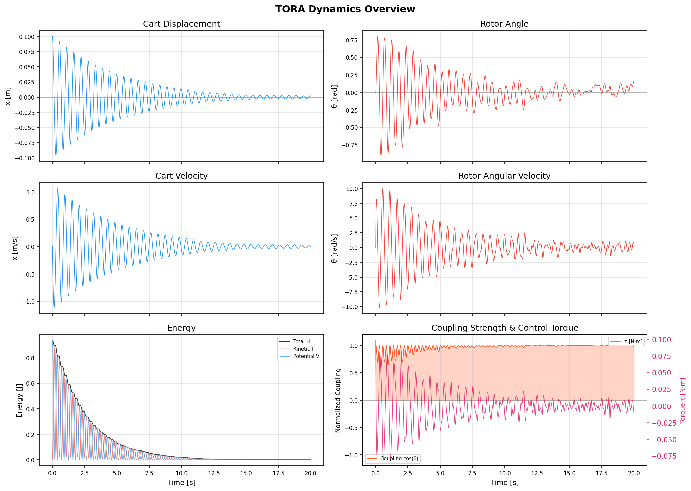
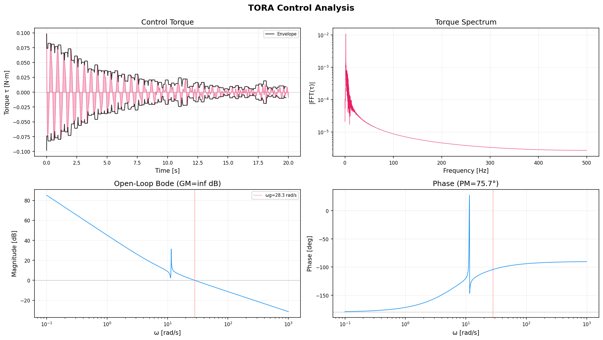
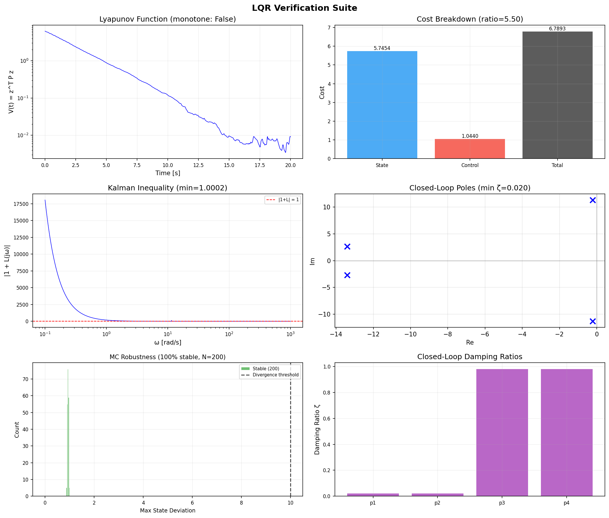
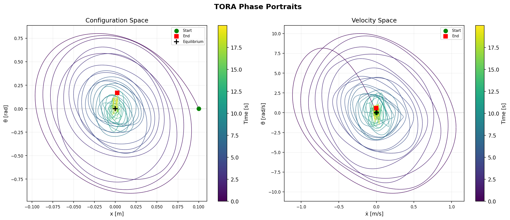
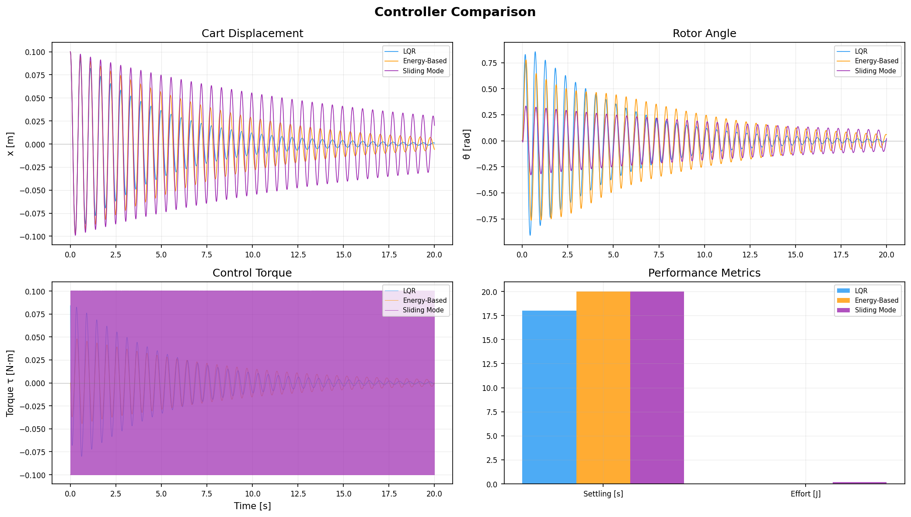

# TORA Nonlinear Optimal Control Simulator

Nonlinear optimal control benchmark simulation of the **Translational Oscillator with Rotational Actuator (TORA)** system, featuring four controller designs (LQR, iLQR, passivity-based, sliding mode), comprehensive analysis, and publication-quality visualizations.

> **Benchmark system**: All physical parameters follow the **Bupp–Bernstein–Coppola RTAC testbed** (University of Michigan, 1998), the most widely cited experimental benchmark for underactuated nonlinear control [2].

> **v1.1** — Bryson's rule R = 1/τ<sub>max</sub>² (saturation-aware LQR, 0% saturation). Leapfrog Störmer-Verlet integrator (bounded energy oscillation). Coriolis matrix Ṁ−2C skew-symmetric passivity verification. Non-dimensional ε coupling parameter. Pole-placement SMC surface design. Optional viscous damping. Physical realizability validation. iLQR final-rollout consistency fix. Config priority: defaults < YAML < CLI. 70 tests passing.

## Quick Start

```bash
pip install -e ".[test]"
python main.py                            # Default LQR simulation
python main.py --compare-all              # Compare all 4 controllers
python main.py --controller energy        # Passivity-based (Jankovic benchmark)
python main.py --controller smc           # Sliding mode control
python main.py --use-ilqr --compare-all   # Include iLQR trajectory optimization
python main.py --adaptive-q               # Inertia-scaled Q matrix (Bryson's rule)
python prebuild_cache.py                  # Pre-build JIT cache
pytest                                    # Run tests (70 tests)
```

## Installation

**Prerequisites**: Python >= 3.9 and pip.

```bash
pip install -e ".[test]"
```

Or using the legacy requirements file:

```bash
pip install -r requirements.txt
```

| Package | Version | Purpose |
|---------|---------|---------|
| numpy | >= 1.24, < 2.1 | Numerical arrays and linear algebra |
| scipy | >= 1.10, < 1.15 | Riccati equation solver, frequency response |
| numba | >= 0.57, < 0.61 | JIT compilation for real-time dynamics |
| matplotlib | >= 3.6, < 3.10 | All plots and animation |
| pillow | >= 9.0, < 11.0 | GIF animation export |
| pyyaml | >= 6.0, < 7.0 | YAML configuration file support |
| pytest | >= 7.0, < 9.0 | Test framework (optional, in `[test]` extra) |

All dependencies carry **upper bounds** to prevent silent breakage from incompatible releases.

## CLI Usage

```bash
python main.py --help

# Custom physical parameters
python main.py --M 2.0 --m 0.1 --e 0.05 --k 200

# Simulation tuning
python main.py --t-end 30 --dt 0.0005 --x0 0.2 --tau-max 0.05

# Enable iLQR trajectory optimization
python main.py --use-ilqr --ilqr-horizon 1000 --ilqr-iterations 20

# Combine features
python main.py --adaptive-q --compare-all --use-ilqr

# Headless mode
python main.py --no-display

# Debug logging
python main.py --log-level DEBUG
```

| Flag | Type | Default | Description |
|------|------|---------|-------------|
| `--M` | float | 1.3608 | Cart mass [kg] |
| `--m` | float | 0.096 | Rotor mass [kg] |
| `--e` | float | 0.0592 | Eccentricity [m] |
| `--k` | float | 186.3 | Spring constant [N/m] |
| `--I` | float | 0.0002175 | Rotor inertia [kg·m²] |
| `--t-end` | float | 20.0 | Simulation duration [s] |
| `--dt` | float | 0.001 | Integration time step [s] |
| `--x0` | float | 0.1 | Initial cart displacement [m] |
| `--tau-max` | float | 0.1 | Torque saturation limit [N·m] |
| `--dist-amplitude` | float | 0.01 | Disturbance RMS [N·m] |
| `--dist-bandwidth` | float | 5.0 | Disturbance cutoff frequency [Hz] |
| `--seed` | int | 42 | Random seed |
| `--controller` | choice | lqr | Controller: `lqr`, `energy`, `smc` |
| `--use-ilqr` | flag | off | Enable iLQR trajectory optimization |
| `--ilqr-horizon` | int | 1000 | iLQR planning horizon steps |
| `--ilqr-iterations` | int | 15 | iLQR iteration count |
| `--compare-all` | flag | off | Run all 4 controllers for comparison |
| `--adaptive-q` | flag | off | Use inertia-scaled Q matrix (Bryson's rule) |
| `--config` | str | None | Path to YAML configuration file |
| `--no-display` | flag | off | Skip matplotlib interactive display |
| `--log-level` | choice | INFO | Logging verbosity: DEBUG, INFO, WARNING |

## YAML Configuration

```bash
cp config.example.yaml config.yaml
python main.py --config config.yaml
```

**Priority**: CLI flags override YAML values, which override built-in defaults.

## Benchmark Parameters

The Bupp–Bernstein–Coppola RTAC system [2] has been the standard benchmark for TORA control since 1995:

| Parameter | Symbol | Value | Unit |
|-----------|--------|-------|------|
| Cart mass | M | 1.3608 | kg |
| Rotor mass | m | 0.096 | kg |
| Eccentricity | e | 0.0592 | m |
| Spring constant | k | 186.3 | N/m |
| Rotor inertia | I | 0.0002175 | kg·m² |
| Total mass | M<sub>t</sub> = M + m | 1.4568 | kg |
| Mass-eccentricity | me | 0.005683 | kg·m |
| Effective inertia | I<sub>eff</sub> = I + me² | 5.539 × 10⁻⁴ | kg·m² |
| Coupling parameter | ε = me / √(M<sub>t</sub>I<sub>eff</sub>) | 0.200 | — |
| Natural frequency | ω<sub>n</sub> = √(k/M<sub>t</sub>) | 11.31 | rad/s |
| Natural period | T = 2π/ω<sub>n</sub> | 0.556 | s |

The coupling parameter ε ≈ 0.200 indicates **weak coupling**: the rotor has limited authority over the cart, making control challenging.

---

## Theory

### 1. System Description

A cart of mass M slides on a horizontal rail, connected to a fixed wall by a linear spring of stiffness k. An eccentric rotor (mass m, eccentricity e, inertia I) is mounted on the cart. The only control input is the torque τ applied to the rotor. The system is **underactuated** (2 DOF, 1 input) and operates in a horizontal plane (no gravity).

Generalized coordinates:

$$\mathbf{q} = \begin{bmatrix} x \\\ \theta \end{bmatrix}$$

where x is the cart displacement and θ is the rotor angle.

### 2. Lagrangian Dynamics

#### 2.1 Kinematics

The eccentric mass position in the world frame:

$$x_{ecc} = x + e \sin\theta, \qquad y_{ecc} = e \cos\theta$$

#### 2.2 Energy

Kinetic energy:

$$T = \frac{1}{2} \dot{\mathbf{q}}^\top M(\theta) \, \dot{\mathbf{q}} = \frac{1}{2} \left[ M_t \dot{x}^2 + 2 m e \cos\theta \, \dot{x} \dot{\theta} + I_{eff} \dot{\theta}^2 \right]$$

Spring potential energy (no gravity — horizontal system):

$$V = \frac{1}{2} k x^2$$

Hamiltonian (conserved when τ = 0):

$$H = T + V$$

#### 2.3 Mass Matrix

$$M(\theta) = \begin{bmatrix} M_t & m e \cos\theta \\\ m e \cos\theta & I_{eff} \end{bmatrix}$$

Key properties:
- **Symmetric**: M = Mᵀ
- **Positive definite**: det(M) = M<sub>t</sub>I<sub>eff</sub> − (me cos θ)² > 0 for all θ (since me² ≪ M<sub>t</sub>I<sub>eff</sub>)
- **Configuration-dependent**: coupling varies with θ. Maximum at θ = 0, zero at θ = π/2

#### 2.4 Coriolis/Centrifugal and Spring Forces

Coriolis vector (from Christoffel symbols):

$$\mathbf{C}(\mathbf{q}, \dot{\mathbf{q}}) = \begin{bmatrix} -m e \, \dot{\theta}^2 \sin\theta \\\ 0 \end{bmatrix}$$

Full Coriolis matrix satisfying Ṁ − 2C is skew-symmetric (fundamental passivity property):

$$C(\mathbf{q}, \dot{\mathbf{q}}) = \begin{bmatrix} 0 & -m e \sin\theta \, \dot{\theta} \\\ 0 & 0 \end{bmatrix}$$

Spring restoring force:

$$\mathbf{K}(\mathbf{q}) = \begin{bmatrix} k x \\\ 0 \end{bmatrix}$$

#### 2.5 Equations of Motion

$$M(\theta) \, \ddot{\mathbf{q}} + \mathbf{C}(\mathbf{q}, \dot{\mathbf{q}}) + \mathbf{K}(\mathbf{q}) = \begin{bmatrix} 0 \\\ \tau \end{bmatrix}$$

Expanded:

$$(M + m)\ddot{x} + m e \ddot{\theta} \cos\theta - m e \dot{\theta}^2 \sin\theta + k x = 0$$

$$m e \ddot{x} \cos\theta + (I + m e^2) \ddot{\theta} = \tau$$

### 3. Control Design

#### 3.1 Linearization

At the equilibrium **q**\* = **0**, **q̇**\* = **0**, the linearized system is fully analytical:

$$A = \begin{bmatrix} 0 & 0 & 1 & 0 \\\ 0 & 0 & 0 & 1 \\\ -\frac{k I_{eff}}{\Delta} & 0 & 0 & 0 \\\ \frac{k \, me}{\Delta} & 0 & 0 & 0 \end{bmatrix}, \qquad B = \begin{bmatrix} 0 \\\ 0 \\\ -\frac{me}{\Delta} \\\ \frac{M_t}{\Delta} \end{bmatrix}$$

where Δ = M<sub>t</sub>I<sub>eff</sub> − (me)².

Key difference from the triple pendulum: the **A matrix has zero damping block** (A[2:4, 2:4] = 0). The open-loop poles are **purely imaginary** (marginally stable oscillation), not unstable.

#### 3.2 LQR (Linear Quadratic Regulator)

Cost function:

$$J = \int_0^\infty \left( \mathbf{z}^\top Q \mathbf{z} + R \tau^2 \right) dt$$

Cost matrices use **Bryson's rule** for actuator-aware scaling:

$$Q = \text{diag}\left(\frac{1}{x_{max}^2}, \frac{1}{\theta_{max}^2}, \frac{1}{\dot{x}_{max}^2}, \frac{1}{\dot{\theta}_{max}^2}\right), \qquad R = \frac{1}{\tau_{max}^2}$$

This ensures the optimal gains respect the physical torque limit without excessive saturation.

#### 3.3 iLQR (Iterative LQR)

Nonlinear trajectory optimization using backward Riccati recursion on the full nonlinear dynamics. Provides time-varying gains that exploit the nonlinear coupling for improved performance.

#### 3.4 Passivity-Based Control (Jankovic-inspired)

Structure inspired by Jankovic, Fontaine & Kokotovic (1996) [1], exploiting the TORA's Hamiltonian structure. Control law:

$$\tau = -k_p \theta - k_d \dot{\theta} - k_c p_\theta$$

where p<sub>θ</sub> = me cos θ · ẋ + I<sub>eff</sub>θ̇ is the angular momentum conjugate to θ. The term k<sub>c</sub>p<sub>θ</sub> transfers energy from the translational mode to the rotational mode where k<sub>d</sub> dissipates it.

**Note**: Default gains are derived from system physical parameters using a principled heuristic (critical damping + natural frequency scaling), not a strict reproduction of the paper's specific gain values. The Lyapunov-like storage function V = ½kx² + p<sub>θ</sub>²/(2I<sub>eff</sub>) + ½k<sub>p</sub>θ² is used for stability monitoring.

#### 3.5 Sliding Mode Control (Pole-Placement Surface)

Sliding surface s = c₁x + c₂θ + c₃ẋ + θ̇ with coefficients derived from **pole placement** on the reduced-order manifold. When s = 0, the dynamics reduce to a 3rd-order system with triple pole at −ω<sub>d</sub> = −0.3ω<sub>n</sub>.

Control law: τ = τ<sub>eq</sub> − η · sat(s/φ)

where τ<sub>eq</sub> enforces ds/dt = 0, η is scaled to ~2% of max spring force, and the boundary layer φ suppresses chattering.

### 4. Numerical Methods

#### 4.1 RK4 Integration (Default)

Standard 4th-order Runge-Kutta. Two implementations:
- **Array-based**: for linearization, Jacobian computation, and iLQR
- **Scalar JIT-compiled**: zero-allocation for the main simulation loop

#### 4.2 Leapfrog Störmer-Verlet Integrator

For separable Hamiltonians H = T(p) + V(q), Störmer-Verlet is exactly symplectic. The TORA has a **configuration-dependent mass matrix**, so the Hamiltonian is NOT separable — this integrator is therefore not exactly symplectic for this system. However, it provides **bounded energy oscillation** (no secular drift) and serves as a useful alternative to RK4 for long-time energy studies.

#### 4.3 RK4(5) Adaptive Step

Dormand-Prince embedded error estimation with safety factor for stiff parameter regimes.

---

## Project Structure

```
parameters/                  System parameters
├── physical.py              PhysicalParams dataclass (M, m, e, k, I)
├── derived.py               Derived quantities (Mt, me, I_eff)
├── nondimensional.py        Non-dimensional model (ε, ωn)
├── packing.py               JIT-compatible flat array [Mt, me, I_eff, k]
├── equilibrium.py           Equilibrium state [0, 0, 0, 0]
└── config.py                SystemConfig (validation + packing)

dynamics/                    Physics engine
├── mass_matrix/assembly.py  2×2 M(θ) — symmetric, positive definite
├── coriolis/
│   ├── coriolis_vector.py   C(q,q̇) force vector
│   └── coriolis_matrix.py   Full C matrix + skew-symmetric verification
├── spring/spring_force.py   K(q) = [kx, 0]
├── damping/viscous_damping.py  Optional c_x·ẋ + c_θ·θ̇ viscous losses
├── trigonometry.py          Shared sin/cos cache
└── forward_dynamics/
    ├── forward_dynamics.py       Array version (for Jacobians)
    ├── forward_dynamics_fast.py  Scalar @njit (for simulation loop)
    ├── solve_acceleration.py     2×2 Cramer's rule
    └── tau_assembly.py           B·τ = [0, τ]

control/                     4 controller designs
├── lqr.py                   LQR with Bryson's rule R = 1/τ²_max
├── ilqr.py                  iLQR trajectory optimization
├── energy_based.py          Passivity-based (Jankovic 1996)
├── sliding_mode.py          SMC with boundary layer
├── closed_loop.py           Pole analysis, damping ratios
├── comparison.py            4-controller side-by-side
├── linearization/           Analytical + numerical Jacobians
├── cost_matrices/           Bryson's rule Q and R
├── gain_computation/        K = R⁻¹BᵀP
└── riccati/                 CARE solver with validation

simulation/                  Simulation engine
├── loop/
│   ├── time_loop.py         High-level simulate() dispatcher
│   ├── time_loop_fast.py    Per-controller @njit loops
│   └── control_law.py       Inline control (anti-windup utility available for LQI)
├── integrator/
│   ├── rk4_step.py          Array + scalar RK4
│   ├── rk45_step.py         Dormand-Prince adaptive
│   ├── stormer_verlet.py    Symplectic integrator
│   └── state_derivative.py  dz/dt = f(z, τ)
├── initial_conditions/      Cart displacement IC
├── disturbance/             Band-limited torque noise
└── warmup.py                JIT pre-compilation

analysis/                    Post-simulation analysis
├── energy/                  T + V, Hamiltonian conservation
├── coupling/                me·cos(θ) strength, det(M), cond(M)
├── frequency/               Bode, poles, margins, sensitivity, step response
├── state/                   Phase portraits, derived quantities
├── lqr_verification/        Lyapunov, Kalman inequality, Nyquist, MC robustness
├── region_of_attraction.py  Grid-based MC in (x₀, θ₀) plane
├── robustness/              Parameter sensitivity + MC perturbation
└── summary/                 Console output table

visualization/               7 figure categories + animation
├── common/                  Colors, axis styling
├── animation/               Cart + spring + eccentric rotor GIF
├── dynamics_plots/          States, energy, coupling
├── control_plots/           Torque envelope, spectrum, Bode
├── lqr_plots/               Lyapunov, cost, Kalman, poles, MC
├── phase_plots/             (x,θ) and (ẋ,θ̇) colored by time
├── comparison_plots/        4-controller overlay
└── roa_plots/               2D ROA contour

tests/                       70 tests across 6 modules
├── test_parameters.py       Validation, packing, edge cases
├── test_dynamics.py         M symmetry/PD, energy conservation, symplectic, skew-symmetric
├── test_linearization.py    Analytical↔numerical, controllability, imaginary-axis poles
├── test_lqr.py              Riccati, Kalman inequality, closed-loop stability
├── test_control.py          Energy decrease, sliding variable convergence
└── test_simulation.py       Convergence, NaN, saturation, disturbance RMS

pipeline/                    Orchestration
├── runner.py                Full pipeline coordinator
├── defaults.py              Default parameters
└── save_outputs.py          PNG/GIF export
```

## Simulation Results

All figures generated by `python main.py --compare-all --no-display` with default benchmark parameters.

### Animation


Cart-spring-rotor system with LQR control. The eccentric mass (red dot) drives the cart vibration to zero through rotational coupling.

### Dynamics Overview



**Top row**: Cart displacement x and rotor angle θ — both decay as LQR dissipates energy. **Middle row**: Velocities showing the coupled oscillation. **Bottom-left**: Total energy H = T + V decreasing monotonically under control (Hamiltonian would be constant without control). **Bottom-right**: Normalized coupling strength cos(θ) with control torque overlay — coupling varies as rotor rotates.

### Control Analysis



**Top-left**: Control torque τ(t) with envelope showing decay — 0% saturation with Bryson's rule R = 1/τ<sub>max</sub>². **Top-right**: Torque frequency spectrum concentrated at the natural frequency (~1.8 Hz). **Bottom**: Open-loop Bode magnitude and phase with gain crossover at ω<sub>g</sub> = 28.3 rad/s and **PM = 75.7°**.

> **Note**: These loop-transfer margins are computed from L(jω) = K(jωI−A)⁻¹B, a SISO surrogate for the full-state feedback system. They serve as robustness indicators, not direct experimental Bode margins.

### LQR Verification Suite



**Top-left**: Lyapunov function V(t) = z<sup>T</sup>Pz decaying over time. **Top-right**: Cost breakdown — state cost dominates control cost (ratio ~5.5:1). **Middle-left**: Kalman return difference |1+L(jω)| ≥ 1 verified (min = 1.0002 — near theoretical lower bound). **Middle-right**: Closed-loop pole map — all poles in LHP. **Bottom-left**: Monte Carlo robustness histogram — **100% stable** across 200 random parameter perturbations (±10% mass/spring, ±5% eccentricity). **Bottom-right**: Damping ratios for each closed-loop pole.

### Phase Portraits



**Left**: (x, θ) configuration space — trajectory spirals from initial displacement toward equilibrium, colored by time (yellow→purple). **Right**: (ẋ, θ̇) velocity space — shows the characteristic TORA coupling where rotor velocity θ̇ is much larger than cart velocity ẋ due to weak coupling (ε ≈ 0.2).

### Controller Comparison



Side-by-side comparison of LQR, passivity-based (energy), and sliding mode controllers. **Top row**: Cart displacement and rotor angle responses. **Bottom-left**: Control torque profiles showing different strategies. **Bottom-right**: Performance metrics — LQR offers the best settling time, energy-based uses least control effort, SMC has smallest peak θ.

---

## Analysis Features

| Category | Description |
|----------|-------------|
| **Energy** | Kinetic + spring potential + Hamiltonian. Conservation verified (symplectic: <0.5% bounded oscillation) |
| **Coupling** | me·cos(θ) coupling strength trajectory. Mass matrix det(M) and condition number tracking |
| **Frequency** | Open/closed-loop Bode, gain/phase margins (PM=75.7° for default), sensitivity S(jω) and T(jω) |
| **LQR Verification** | Lyapunov V(t) = zᵀPz monotonicity. Kalman \|1+L(jω)\| ≥ 1. Cost breakdown. MC robustness (100% stable) |
| **Phase Portraits** | 2D (x, θ) configuration space and (ẋ, θ̇) velocity space, colored by time |
| **ROA** | Grid-based Monte Carlo over (x₀, θ₀). Clean 2D contour visualization |
| **Robustness** | ±10% mass/spring, ±5% eccentricity perturbation. Per-parameter pole sensitivity |

## Performance

| Metric | Value |
|--------|-------|
| Simulation speed (20s, dt=1ms) | ~0.02s (after JIT warmup) |
| JIT warmup | ~0.5s (one-time) |
| Memory (20s simulation) | ~2 MB (pre-allocated arrays) |
| MC robustness (200 trials) | ~3s |
| ROA estimation (51×51 grid) | ~30s |

All hot-path functions use `@numba.njit(cache=True)` with scalar arithmetic (zero allocation inside simulation loops).

## Testing

```bash
pytest tests/ -v              # 70 tests
pytest tests/ -v --tb=short   # Compact output
```

Key test categories:
- **Physics invariants**: M symmetry, positive definiteness, det(M) > 0, skew-symmetric Ṁ−2C
- **Energy conservation**: RK4 (<1% drift, 5000 steps), Störmer-Verlet (<0.5% bounded)
- **Control correctness**: LQR poles in LHP, Kalman inequality, energy decrease under passivity control
- **Numerical consistency**: Array↔scalar forward dynamics agreement to 10⁻¹⁰ relative error

## References

1. Jankovic, M., Fontaine, D. & Kokotovic, P.V. (1996). "TORA Example: Cascade- and Passivity-Based Control Designs." *IEEE Trans. Control Systems Technology*, 4(3), 292-297.
2. Bupp, R.T., Bernstein, D.S. & Coppola, V.T. (1998). "Experimental Implementation of Integrator Backstepping and Passive Nonlinear Controllers on the RTAC Testbed." *Int. J. Robust and Nonlinear Control*, 8(4/5), 435-457.
3. Escobar, G., Ortega, R. & Sira-Ramirez, H. (1999). "Output-Feedback Global Stabilization of a Nonlinear Benchmark System Using a Saturated Passivity-Based Controller." *IEEE Trans. Control Systems Technology*, 7(2), 289-293.
4. Olfati-Saber, R. (2002). "Normal Forms for Underactuated Mechanical Systems with Symmetry." *IEEE Trans. Automatic Control*, 47(2), 305-308.
5. Celani, F. (2011). "Output Regulation for the TORA Benchmark via Rotational Position Feedback." *Automatica*, 47(3), 584-590.
